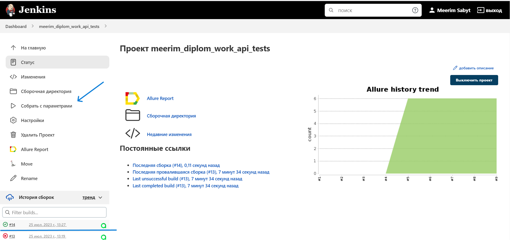
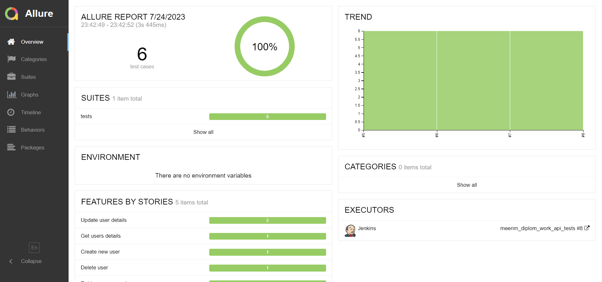
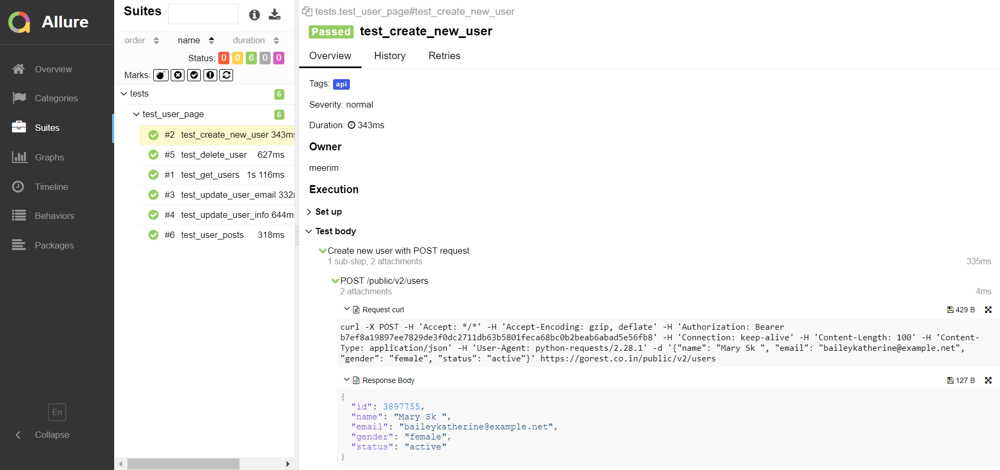
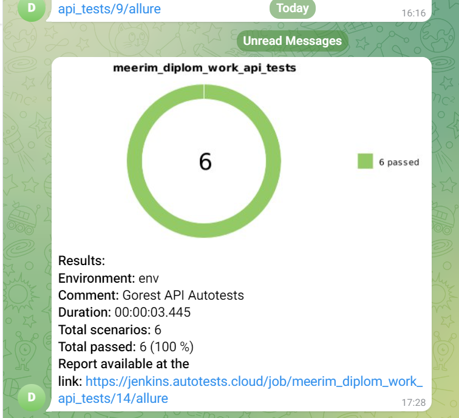

## API Autotests project for gorest.co.in

  

24/7 online fake GraphQL and REST API service for quick testing and prototyping of web and android applications.

### Tools and a technologies used

<code></code>
<code></code>
<code></code>
<code></code>
<code></code>
<code></code>
<code></code>
<code></code>
<code></code>
<code></code>

  

### Specific scenarios that were checked
* Get Users Details - Verify Successful Response and Schema
* Create New User - Verify Successful User Creation and ID
* Update User Email - Verify Successful Email Update
* Update User Details - Verify Successful User Details Update
* Delete User - Verify Successful User Deletion
* User posts - Verify Successful Response and Schema,ID
 

<!-- Jenkins -->

###  Running tests from Jenkins
### [Job](https://jenkins.autotests.cloud/job/meerim_diplom_work_api_tests/)
##### Main page of the build:

##### After the build is done the test results are available in Allure Report and Allure TestOps

<!-- Allure report -->

###  Allure report
##### From main page of Allure report can see  :

>- <code><strong>*ALLURE REPORT*</strong></code> -date and time of the test, overall number of launched tests,
>- <code><strong>*TREND*</strong></code> - trend of running tests for all runs
>- <code><strong>*SUITES*</strong></code> - distribution of tests by suites
>- <code><strong>*CATEGORIES*</strong></code> - distribution of unsuccessful tests by defect types

##### On the page the list of the tests grouped by suites with status shown for each test.

<!-- Allure TestOps -->

###  Allure TestOps Integration
### [Dashboard](https://allure.autotests.cloud/project/2086/dashboards)
##### Results are uploaded there and the automated test-cases can be automatically updated accordingly to the recent changes in the code.

Test-cases in the project are imported and constantly updated from the code,
so there is no need in complex process of synchronization manual test-cases and autotests.\
It is enough to create and update an autotest in the code and the test-case in TMS always will be in actual state.\
Manual test-cases also can be added in TMS in case of need(via web interface or via code).

<!-- Jira -->

###  Jira integration
##### After configuration TestOps we can integrate results launches in Jira

<!-- Telegram -->

###  Telegram Notifications
##### Telegram bot sends a brief report to a specified telegram chat by results of each build.

